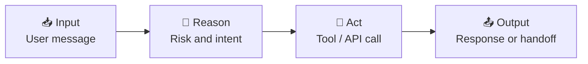
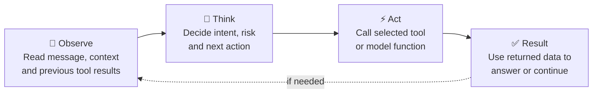
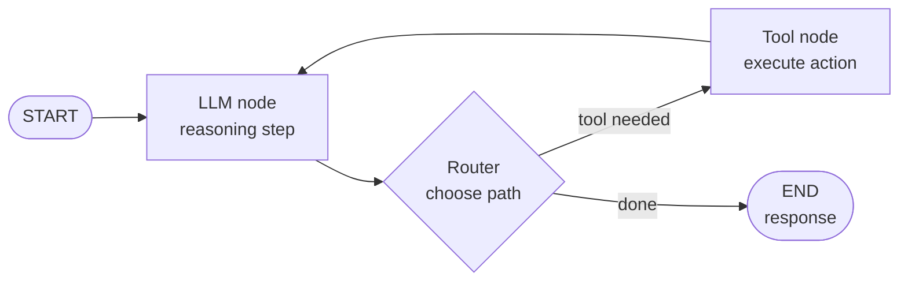
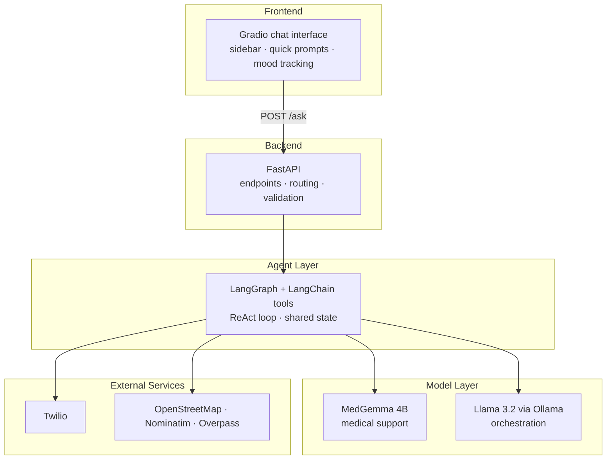
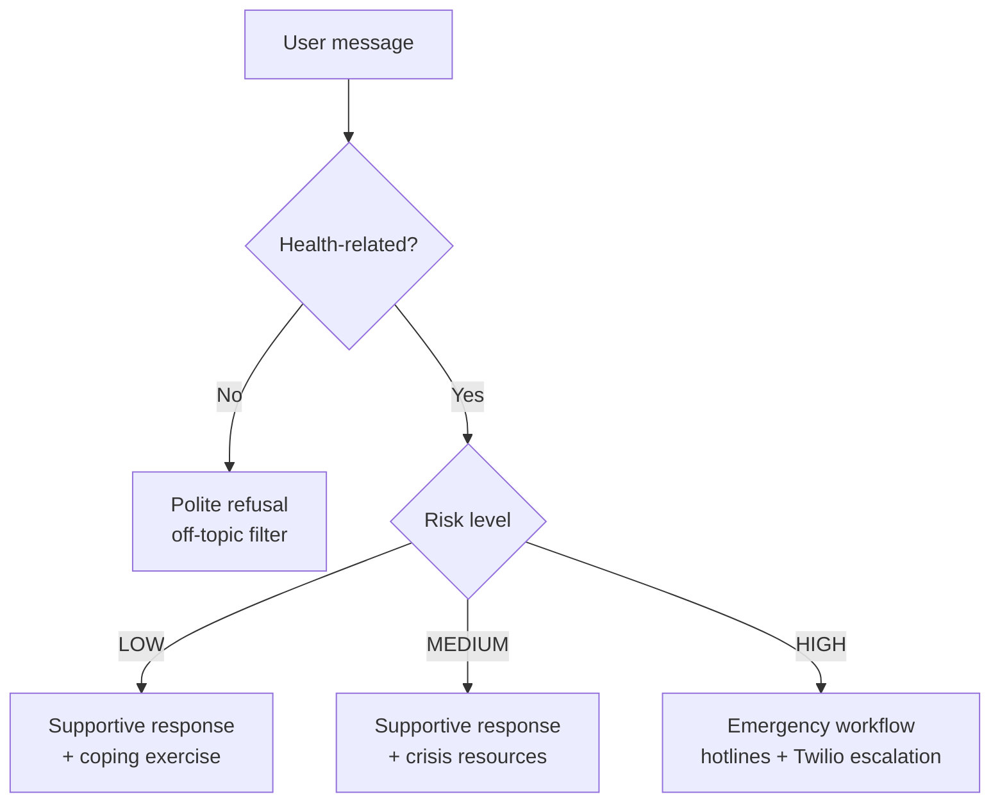

<h1 align="center">🌿 SafeSpace AI</h1>

<p align="center">
  <b>An agentic AI mental-health support assistant</b><br>
  LangGraph · ReAct · MedGemma · Llama 3.2 · FastAPI · Gradio
</p>

<p align="center">
  
  
  
  
  
  
  
</p>

> ⚠️ **SafeSpace AI is a student project and not a replacement for professional help.**
> If you are in danger or thinking about harming yourself, call **112** (EU) or your local emergency number.
> In Germany, the Telefonseelsorge is available 24/7 at **0800 111 0 111**.

---

## 📑 Table of Contents
1. [About the Project](#-about-the-project)
2. [Why an Agent?](#-why-an-agent)
3. [Core Concept: Agentic AI](#-core-concept-agentic-ai)
4. [The ReAct Pattern](#-the-react-pattern)
5. [Main Tool: LangGraph](#%EF%B8%8F-main-tool-langgraph)
6. [Tool Calling](#-tool-calling)
7. [System Architecture](#%EF%B8%8F-system-architecture)
8. [Tool Stack](#%EF%B8%8F-tool-stack)
9. [AI Models](#-ai-models)
10. [Safety Workflow](#-safety-workflow)
11. [Features](#-features)
12. [Project Structure](#-project-structure)
13. [Getting Started](#-getting-started)
14. [API](#-api)
15. [Comparisons](#%EF%B8%8F-comparisons)
16. [Results, Limitations and Future Work](#-results-limitations-and-future-work)
17. [References](#-references)
18. [Author](#-author)

---

## 🌷 About the Project

**SafeSpace AI** is a mental-health and medical support assistant built as an **agentic AI system**. Instead of only answering with text like a normal chatbot, it:

- **observes** the user's message and conversation context,
- **reasons** about intent, mood and crisis risk,
- **acts** by calling the right tool (supportive response, crisis resources, clinic search, SOAP note, emergency escalation),
- and **evaluates** the result before responding.

The project was built for the *Master in Software Engineering for Industrial Applications* at **Hochschule Hof**. Its main purpose is to explain and demonstrate the **concepts and tools behind agentic AI**, with SafeSpace AI as the running example.

---

## ❓ Why an Agent?

| Problem | Why it matters |
|---|---|
| 🕐 **Mental-health support gap** | Support is often delayed, expensive or unavailable outside working hours. A software system needs to respond quickly and safely. |
| 💬 **Normal chatbot limitation** | A plain chatbot mainly answers text. It cannot reliably coordinate risk checks, APIs, routing and structured outputs. |
| 🤖 **Agentic solution** | An agent can reason over context, choose actions, call tools and produce different outputs depending on the risk level. |



---

## 🧠 Core Concept: Agentic AI

> **An AI agent is an LLM connected to tools, state and control logic.**
> The LLM is the *brain*, tools are the *hands*, state is the *memory*, and the graph is the *control system*.

| Traditional LLM Chat | Agentic AI System |
|---|---|
| Produces one text answer | Plans, routes and executes steps |
| No direct external action | Uses APIs, tools and services |
| Usually stateless interaction | Maintains state, memory and results |
| Same model for most tasks | Combines models, tools and rules |
| Passive response pattern | Proactive risk detection and workflow control |

### Building blocks of an AI agent

| Block | Role |
|---|---|
| 🧠 **Model** | Understands text, reasons and generates the next step |
| 🗂️ **State** | Stores messages, risk scores, tool outputs and metadata |
| 🔧 **Tools** | External functions such as clinic search or emergency call |
| 🔀 **Router** | Decides which path or tool should run next |
| 🛡️ **Guardrails** | Limit unsafe, off-topic or low-confidence responses |
| 📤 **Output** | Final response, structured note or escalation action |

In this project, these blocks are implemented with **LangGraph + LangChain tools**.

---

## 🔁 The ReAct Pattern

**ReAct = Reason + Act** (Yao et al., 2022). The model does not only answer; it decides which action is needed, executes it, and uses the result.



### ReAct in the SafeSpace agent

| Step | What happens |
|---|---|
| 👀 **Observe** | The message suggests distress or a crisis |
| 💭 **Think** | Classify risk as **LOW**, **MEDIUM** or **HIGH** |
| ⚡ **Act** | Route to the correct tool |
| ✅ **Result** | Return a safe response or escalate |

---

## 🕸️ Main Tool: LangGraph

**LangGraph** is a framework for building **stateful agent workflows as graphs**. Nodes are processing steps, edges control the next step, and a shared state object carries memory through the graph.

> **LangGraph is not the AI model. It is the workflow framework around the model.**



**Shared state** moving through the graph: messages, risk level, selected tool, API results, location data and the final output.

```python
# In code
graph = create_react_agent(llm, tools=[...])
# Result: a repeatable, debuggable and testable agent workflow
```

### Why LangGraph fits this project
The assistant needs **branching logic**: normal response, crisis flow, clinic search, pharmacy search, SOAP note and safe refusal.

| Feature | Benefit |
|---|---|
| Graph structure | Clear workflow |
| State object | Shared memory |
| Tool nodes | API execution |
| Conditional edges | Dynamic routing |
| Human-in-the-loop | Approval option |
| Streaming | Better chat UX |

### Why LangGraph remains relevant
- **Complex workflows:** agents need branching, loops and conditional steps
- **Regulated domains:** healthcare-style workflows benefit from state, logging and control
- **Local model support:** works with Ollama and local models for privacy-oriented deployments
- **Debugging:** the graph structure makes behaviour easier to explain during testing

---

## 🔧 Tool Calling

Tool calling means the model does not perform every task itself. It **selects a named function, sends structured arguments, and receives a structured result**. This is the bridge between language and software actions.

| Tool type | Example in the project |
|---|---|
| 🩺 Clinical response tool | MedGemma generates a health-focused supportive response |
| 🚨 Crisis escalation tool | Twilio call workflow when high-risk keywords appear |
| 📍 Location tool | OpenStreetMap, Nominatim and Overpass search nearby clinics and pharmacies |
| 📝 Documentation tool | SOAP note generator with ICD-10 style structure |
| 🛡️ Safety filter | Blocks unrelated or unsafe non-health requests |

---

## 🏛️ System Architecture



| Layer | Technology | Responsibility |
|---|---|---|
| **Frontend** | Gradio | Chat interface, sidebar, quick prompts, live mood and risk panels |
| **Backend** | FastAPI | Endpoints, topic filter, crisis pre-check, routing, validation, service integration |
| **Agent layer** | LangGraph + LangChain | ReAct loop, tool selection, shared state |
| **Model layer** | MedGemma 4B, Llama 3.2 (Ollama) | Health responses and agent orchestration |
| **External services** | Twilio, OpenStreetMap, Nominatim, Overpass | Emergency calls, clinic and pharmacy search |

---

## 🛠️ Tool Stack

| Tool | What it does | Concept it implements |
|---|---|---|
| **LangGraph** | Agent graph, state, routing | Stateful agent workflow |
| **FastAPI** | Backend API layer | Service integration |
| **Gradio** | Local chat interface | User interaction |
| **MedGemma** | Health-focused generation | Domain-specialised model |
| **Ollama / Llama 3.2** | Local orchestration model | Private, local LLM runtime |
| **Twilio** | Emergency call / SMS integration | Crisis escalation action |
| **OpenStreetMap** | Clinic and pharmacy search | Location tool |
| **ICD-10 / SOAP** | Structured clinical-style notes | Structured documentation output |

---

## 🤖 AI Models

| Model | Role | Why |
|---|---|---|
| **MedGemma 4B** (`alibayram/medgemma:4b`) | Health-oriented responses and structured clinical-style output | Open health AI model family built for medical text and image understanding |
| **Llama 3.2** (`llama3.2` via Ollama) | Orchestration and agent behaviour | Local execution supports privacy and lower dependency on hosted APIs |

> **Separation of roles:** a specialised model for health responses + a general local model for workflow control = a safer and more modular architecture.

---

## 🚦 Safety Workflow

Every message goes through a controlled routing system, not only prompt engineering.



| Risk level | Example signals | Agent behaviour |
|---|---|---|
| 🟢 **LOW** | sad, anxious, stressed | Therapy-style response, breathing guide, sleep advice or mood support |
| 🟠 **MEDIUM** | hopeless, trapped, "give up" | Supportive response plus crisis resources and monitoring |
| 🔴 **HIGH** | suicide, self-harm, "end my life" | Emergency workflow: hotline information and Twilio escalation |
| ⚪ **Off-topic** | non-health questions | Health-topic filter politely declines |

### SOAP note generator
The agent can also produce **handoff-style documentation** in the SOAP format:

| Section | Content |
|---|---|
| **S**ubjective | What the user reports |
| **O**bjective | Observed signals (mood, risk level) |
| **A**ssessment | Clinical-style assessment with ICD-10 style structure |
| **P**lan | Suggested next steps |

> The agent output is not only chat. It can create structured documents and trigger safety flows.

---

## ✨ Features

- 💬 **Supportive conversation** powered by MedGemma 4B
- 🧠 **LangGraph ReAct agent** with Llama 3.2 for tool selection
- 🚦 **Three-level crisis detection** (LOW / MEDIUM / HIGH) with a dedicated workflow for each
- 📞 **Emergency escalation** via Twilio (optional, disabled when not configured)
- 🏥 **Clinic and 💊 pharmacy finder** using OpenStreetMap, Nominatim and Overpass
- 📝 **SOAP note generation** with ICD-10 style structure
- 📊 **Mood tracking** and mood history
- 🛡️ **Health-topic filter** for off-topic requests
- ⚡ **Quick prompts**: feeling anxious, find hospitals, find pharmacy, sleep issues, overwhelmed, breathing, mood history, hotlines
- 🎨 **Live dashboard** in the UI: current mood, risk status and session stats

---

## 📁 Project Structure

```
safespace-ai/
├── backend/
│   ├── main.py          # FastAPI app: /ask endpoint, topic filter, crisis pre-check, routing
│   ├── ai_agent.py      # LangGraph ReAct agent (Llama 3.2) and tool definitions
│   ├── tools.py         # MedGemma queries, Twilio call, risk detector, OSM search, SOAP notes
│   └── config.py        # Settings loaded from environment variables (.env)
├── docs/
│   └── SafeSpace_AI_Presentation.pptx   # Project presentation
├── gradio_frontend.py   # Gradio chat interface (port 7860)
├── frontend.py          # Earlier Streamlit prototype of the chat interface
├── Dockerfile           # One container with Ollama, both models, backend and frontend
├── start.sh             # Starts Ollama, FastAPI and Gradio in order (used by Docker)
├── .env.example         # Template for optional Twilio settings
├── pyproject.toml       # Python dependencies (managed with uv)
├── uv.lock              # Locked dependency versions
└── LICENSE              # MIT License
```

---

## 🚀 Getting Started

### Requirements
- **Python 3.14**
- [**uv**](https://docs.astral.sh/uv/) package manager
- [**Ollama**](https://ollama.com) (runs the models locally)
- ~8 GB of free RAM for both models

### 1. Clone and install
```bash
git clone https://github.com/Jatin1Mathur/safespace-ai.git
cd safespace-ai
uv sync
source .venv/bin/activate
```

### 2. Download the models
```bash
ollama pull llama3.2
ollama pull alibayram/medgemma:4b
```

### 3. (Optional) Configure Twilio
```bash
cp .env.example .env
```
Fill in your Twilio details. **Emergency calls are only enabled when all four Twilio values are set.** Without them, the app runs in a safe demo mode and shows emergency numbers instead.

### 4. Start the backend (terminal 1)
```bash
cd backend
python main.py
```
The API runs on http://localhost:8000.

### 5. Start the frontend (terminal 2)
```bash
python gradio_frontend.py
```
Open **http://localhost:7860**.

### Share a public demo link
[Cloudflare Tunnel](https://developers.cloudflare.com/cloudflare-one/connections/connect-apps/) creates a temporary public HTTPS link, with no account needed:
```bash
cloudflared tunnel --url http://localhost:7860
```
For public demos, disable real emergency calls by starting the backend with:
```bash
TWILIO_ACCOUNT_SID="" python main.py
```

### Run with Docker
```bash
docker build -t safespace-ai .
docker run -p 7860:7860 safespace-ai
```
The first build downloads both models (~5 GB), so it takes a while.

---

## 🔌 API

### `POST /ask`
Send a user message to the agent.

**Request**
```json
{ "message": "I feel really anxious today" }
```

**Response** (fields used by the frontend)
```json
{
  "response": "…supportive reply…",
  "tool_called": "…name of the tool the agent used…",
  "mood": "anxious",
  "risk": "LOW"
}
```

---

## ⚖️ Comparisons

### LLM vs AI Agent

| Dimension | LLM | AI Agent |
|---|---|---|
| Main function | Generate text | Complete a task through steps |
| Memory | Prompt/context only | State object and history |
| Tools | Optional or none | Central part of the workflow |
| Control logic | Mostly prompt-driven | Graph/routing-driven |
| Output | Answer | Answer, API action, document, escalation |
| Example | ChatGPT-style response | LangGraph SafeSpace workflow |

### LangGraph vs alternatives

| Feature | LangGraph | AutoGen | CrewAI | Sequential chain |
|---|---|---|---|---|
| State management | Strong | Partial | Limited | Limited |
| Cyclic workflows | Supported | Supported | Limited | No |
| Human approval | Built-in pattern | Manual | Manual | Manual |
| Debugging / tracing | LangSmith | Basic | Basic | LangSmith |
| Production control | High | Medium | Medium | Medium |
| Best fit | Complex agents | Multi-agent research | Role-based tasks | Linear flows |

LangGraph is the best fit here because the project needs **state, routing and safety paths**.

### MedGemma vs major AI models

| Model family | Best strength | Limitation for this project | Best role |
|---|---|---|---|
| **MedGemma** | Health-domain text/image comprehension | Requires validation before clinical use | Medical support response |
| **OpenAI GPT** | General reasoning, coding, tool calling | Hosted API, broad general model | General assistant or orchestration |
| **Claude** | Long-form reasoning and careful writing | Hosted API, not health-specialised by default | Analysis, documentation, coding |
| **Gemini** | Multimodal, Google ecosystem integration | General model, needs healthcare adaptation | Multimodal assistant |
| **Llama** | Open/local deployment and privacy control | Smaller models can be weaker on medical nuance | Local workflow model |
| **Mistral / open models** | Fast, deployable, cost-controlled | Domain tuning may be required | Lightweight local services |

> **Decision:** MedGemma is preferred for medical content; general LLMs are better for broad tasks and coding.

---

## 📊 Results, Limitations and Future Work

| ✅ Implemented | ⚠️ Limitations | 🚀 Future work |
|---|---|---|
| MedGemma responses | Not a doctor replacement | Multilingual mode |
| LangGraph agent | Needs clinical validation | Voice input |
| FastAPI backend | Keyword risk detection can miss context | User login |
| Gradio interface | External APIs can fail | Database history |
| Crisis detection | Privacy and compliance must be reviewed | Human review path |
| Twilio emergency call | | PDF export |
| Clinic / pharmacy finder | | Stronger emotion model |
| SOAP note output | | |

---

## 📚 References

- Yao, S. et al. (2022). *ReAct: Synergizing Reasoning and Acting in Language Models.* [arXiv:2210.03629](https://arxiv.org/abs/2210.03629)
- [LangGraph documentation](https://langchain-ai.github.io/langgraph/)
- [Google MedGemma documentation](https://developers.google.com/health-ai-developer-foundations/medgemma)
- [Meta Llama documentation](https://www.llama.com/docs/overview/)
- [Ollama documentation](https://github.com/ollama/ollama)
- WHO guidance on safe messaging about suicide
- ICD-10 classification (WHO)

---

## 👤 Author

**Jatin Mathur**
Master in Software Engineering for Industrial Applications, **Hochschule Hof**

[](https://github.com/Jatin1Mathur)

---

## 📄 License

This project is licensed under the [MIT License](LICENSE).
